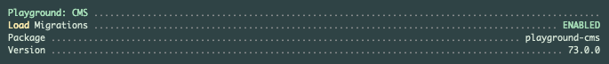

# Playground: CMS

[](https://raw.githubusercontent.com/gammamatrix/playground-cms/testing/develop/testdox.txt)
[](tests)
[](.github/workflows/ci.yml#L128)

The Playground CMS is a package for [Laravel](https://laravel.com/docs/12.x) applications.

Playground: Provides the CMS models for the Playground Content Management System.

Read more on using [Playground: CMS at Read the Docs](https://gammamatrix-playground.readthedocs.io/en/develop/built-components/cms.html)

## Installation

**NOTE:** This package is required by:
- [Playground: CMS API](https://github.com/gammamatrix/playground-cms-api): API without UI
- [Playground: CMS Resource](https://github.com/gammamatrix/playground-cms-resource): API with UI

Install this package, with composer, to get access to the CMS Models:

```bash
composer require gammamatrix/playground-cms
```

## `artisan:about`

Playground CMS provides information in the `artisan about` command.



## Configuration

Migrations are disabled by default. This package may sometimes be installed where another system handles the migrations.

See the contents of the published config file: [config/playground-cms.php](config/playground-cms.php)

You can publish the config file with:
```bash
php artisan vendor:publish --provider="Playground\Cms\ServiceProvider" --tag="playground-config"
```

### Environment Variables

|  env()                           | config()                         | Default |
|----------------------------------|----------------------------------|---------|
| `PLAYGROUND_CMS_ABOUT`           | `playground-cms.about`           | `true`  |
| `PLAYGROUND_CMS_LOAD_MIGRATIONS` | `playground-cms.load.migrations` | `false` |
- The loading option for migrations does not take effect if the migrations have been exported to your app. The control for loading is handled in the package [ServiceProvider.](src/ServiceProvider.php)

## Models

This package includes [factories](database/factories), models and [migrations](database/migrations) for:
- [Page](src/Models/Page.php)
- [PageRevision](src/Models/PageRevision.php)
- [Snippet](src/Models/Snippet.php)
- [SnippetRevision](src/Models/SnippetRevision.php)

## Migrations

All migrations are disabled by default.

See the contents of the published config file: [database/migrations](database/migrations)
- NOTE: There are 4 tables that will be created, they do have indexes and unique constraints defined; however, this release does not have the foreign key constraint migrations included at this time.

You can publish the migrations file with:
```bash
php artisan vendor:publish --provider="Playground\Cms\ServiceProvider" --tag="playground-migrations"
```

## Cloc

```sh
composer cloc
```

```
➜  playground-cms git:(develop) ✗ composer cloc
      75 text files.
      71 unique files.
      11 files ignored.

github.com/AlDanial/cloc v 2.06  T=0.03 s (2249.2 files/s, 497448.3 lines/s)
-------------------------------------------------------------------------------
Language                     files          blank        comment           code
-------------------------------------------------------------------------------
JSON                            29              0              0          11725
PHP                             29            322            729           2079
XML                              8              0              7            380
YAML                             1              5              0            275
Markdown                         3             46              0            120
INI                              1              3              0             12
-------------------------------------------------------------------------------
SUM:                            71            376            736          14591
-------------------------------------------------------------------------------
```

## PHPStan

Tests at level 10 on:
- `config/`
- `database/`
- `src/`
- `tests/Feature/`
- `tests/Unit/`

```sh
composer analyse
```

## Coding Standards

```sh
composer format
```

## Testing

Unit tests
```sh
composer test
```

Unit and feature tests
```sh
composer test-dev
```

Run unit and feature tests in parallel:
```sh
composer test-parallel
```

## Changelog

Please see [CHANGELOG](CHANGELOG.md) for more information on what has changed recently.

## Credits

- [Jeremy Postlethwaite](https://github.com/gammamatrix)

## License

The MIT License (MIT). Please see [License File](LICENSE.md) for more information.
